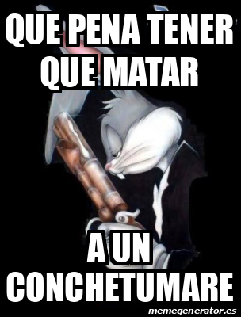

¿Quién chucha hace un blog en 2026? Eso diría un 
conchetumare. Pero tú estas leyendo esto, así que algo te interesa.

Hacer música y que te escuchen te pone en un lugar extraño donde la gente te mira, pero no por lo que vas a decir (fuera de las letras de las canciones). Están esos momentos después de una tocata en que a quienes les gusta tu música se acercan a saludar, y... ¿después qué?. Ellos no te conocen en profundidad, y si no te conocen, podrían estar completamente desalineados con lo que realmente te mueve.

Por eso, nos gusta la idea de aprovechar ese espacio para mostrar los valores que guían el proyecto. Este blog es una especie de declaración de intenciones, de que (obviamente!!!!!) se puede aprovechar la internet fuera de las plataformas principales (ig, tiktok, facebok?????) para mostrar algo personal, hecho con cariño y propósito.

<blockquote>
"Los silos corporativos de Internet erosionan la soberanía sobre nuestros datos y nos vuelven dependientes a formatos y condiciones sobre los cuales no tenemos ningún control. Una web pequeña DIY te otorga libertad absoluta para hacer weás bacanes y creativas."
</blockquote>
  

  -☝️
  
  

Queremos contar nuestras perspectivas sobre diferentes temas, alguna que otra historia anecdótica, y algo muy importante también para nosotros: el detalle de cómo ha sido hacer música, desde nuestros comienzos hasta cómo grabamos los (futuros) discos. Así cualquiera que esté haciendo esto por su cuenta puede aprender de nuestra (in)experiencia, y quizás ahorrarse un par de porrazos.

En volá hasta después se convierte en un espacio de discusión, quién sabe (Álvaro agrega comentarios!!!).

Esperamos que lo disfruten, como nosotros disfrutamos escribir y programar.

